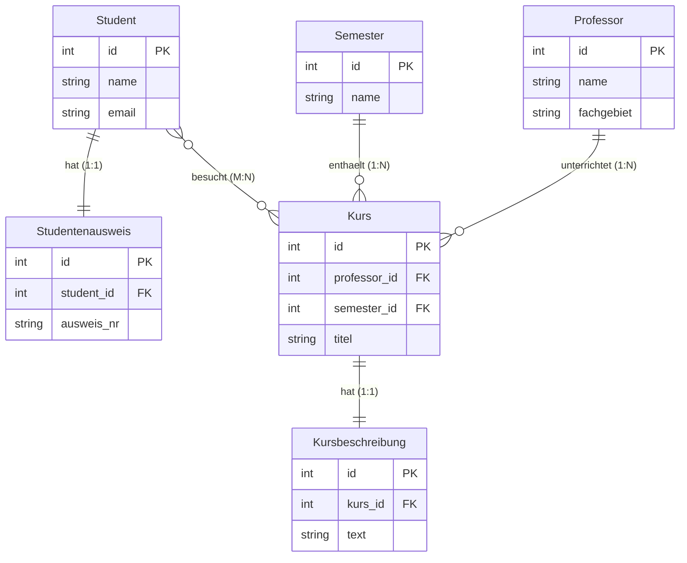

# Uni Relations

Übungsaufgabe: Modellierung eines Universitätssystems mit Django.

## Datenbankstruktur

```mermaid
erDiagram
    Student ||--|| Studentenausweis : "hat (1:1)"
    Professor ||--o{ Kurs : "unterrichtet (1:N)"
    Semester ||--o{ Kurs : "enthaelt (1:N)"
    Kurs ||--|| Kursbeschreibung : "hat (1:1)"
    Student }o--o{ Kurs : "besucht (M:N)"

    Student {
        int id PK
        string name
        string email
    }
    Studentenausweis {
        int id PK
        int student_id FK
        string ausweis_nr
    }
    Professor {
        int id PK
        string name
        string fachgebiet
    }
    Semester {
        int id PK
        string name
    }
    Kurs {
        int id PK
        int professor_id FK
        int semester_id FK
        string titel
    }
    Kursbeschreibung {
        int id PK
        int kurs_id FK
        string text
    }
```